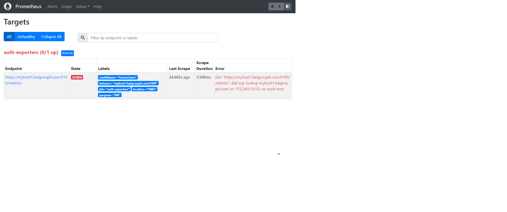

In this first lab you are going to configure Prometheus to scrape the OpenShift-external targets by using file service discovery.

### Task {}.1: Create static targets

We are going to use the files service discovery mechanism that has been deployed on OpenShift. As file input you will create a ConfigMap defining the static targets.

In the monitoring folder within you repository, create a YAML file defining a ConfigMap and add th e file to your repository. You can take the below example as inspiration.

```yaml
apiVersion: v1
kind: ConfigMap
metadata:
  name: mylinuxvms # provide a name
  labels:
    monitoring: external # provide label to match monitoring procedure
data:
  auth-mylinuxvms.yaml: | # provide an unique file name (filename starting  with auth_* will use default credentials | filename starting with nonauth_ will not use authentication)
    - targets: # provide targets
        - myhost1.balgroupit.com:9100 # path defaults to /metrics
      labels: # provide additional labels (optional)
        cmdbName: ServerLinux
        location: OMO
        purpose: VM
```

In our example we added the host `myhost1.balgroupit.com` with an exporter running on port 9100 as static target. We also added custom labels to help us identify our metrics.

### Task {}.2: Verify

As soon as the ConfigMap has been synchronized by ArgoCD, your defined targets should appear in Prometheus in the "Status -> Targets" submenu.

FIXME: Prometheus URL



As you can see, the target is down and cannot be scraped by Prometheus. The reason is provided in the error message: "Get "https://myhost1.balgroupit.com:9100/metrics": dial tcp: lookup myhost1.balgroupit.com on 172.24.0.10:53: no such host"

In our example we used a non-existing host `myhost1.balgroupit.com`. To fix this, use an existing host as your target.
