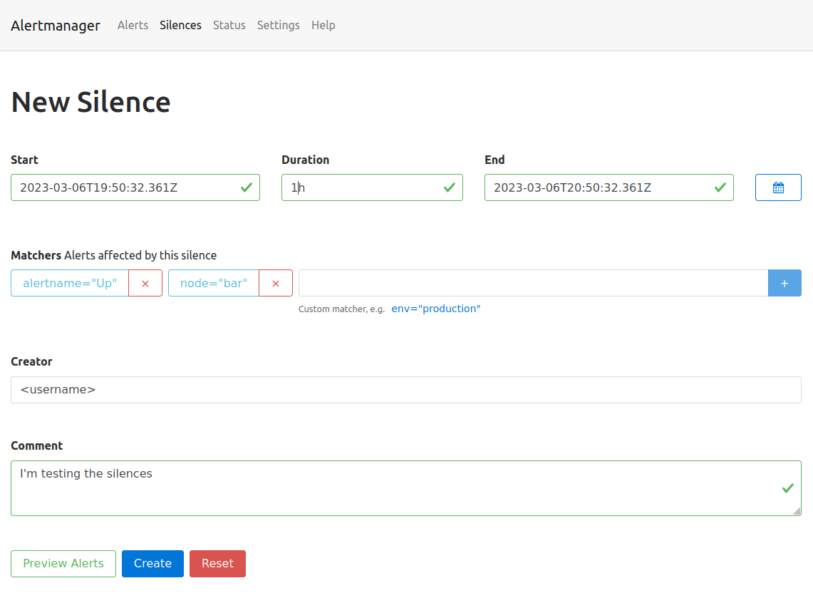

### Task {}.1: Add alerting rules

{}
Alertmanager will automatically send mails to the defined `responsible` email address in the teams root configuration when you set the label `severity=critical` in your PrometheusRule.
To change this behaviour and/or add Alerting to MS Teams, check the documentation [03 - Setup custom alerting rules](https://confluence.baloisenet.com/atlassian/display/BALMATE/03+-+Setup+custom+alerting+rules#id-03Setupcustomalertingrules-Alerting) in Confluence.
{}

The Prometheus Operator allows you to configure Alerting Rules (PrometheusRules). This enables OpenShift users to configure and maintain alerting rules for their projects. Furthermore it is possible to treat Alerting Rules like any other Kubernetes resource and lets you manage them in Helm or Kustomize. A PrometheusRule has the following form:

```yaml
apiVersion: monitoring.coreos.com/v1
kind: PrometheusRule
metadata:
  name: <resource-name>
spec:
  <rule definition>
```

See [the Alertmanager documentation](https://prometheus.io/docs/prometheus/latest/configuration/alerting_rules/) for `<rule definition>`

Example:
To add an Alerting rule, create a PrometheusRule resource `training_testrules.yaml` in the monitoring folder of your CAASI Team Config Repository.

```yaml
apiVersion: monitoring.coreos.com/v1
kind: PrometheusRule
metadata:
  name: testrules
spec:
  groups:
    - name: testrulesgroup
      rules:
        - alert: kubePodCrashLooping # this will be the mail subject, enter which ever text you want
          expr: rate(kube_pod_container_status_restarts_total{job="kube-state-metrics",namespace="testnamespace"}[5m]) * 60 * 5 > 0
          for: 15m
          annotations:
            message: Pod {{ $labels.namespace }}/{{ $labels.pod }} ({{ $labels.container }}) is restarting {{ printf "%.2f" $value }} times / 5 minutes.
          labels:
            severity: info
```

This will fire an alert, everytime the following query matches

```
rate(kube_pod_container_status_restarts_total{job="kube-state-metrics",namespace="testnamespace"}[5m]) * 60 * 5 > 0
```

You can build/verify your Query in your [Thanos Querier UI](http://{}). As soon, as you apply the PrometheusRule resource, you should be able to see the alert in your [Thanos Ruler](http://{}) implementation.

### Task {}.2: Send a test alert

In this task you can use the [amtool](https://github.com/prometheus/alertmanager#amtool) command to send a test alert.

{}

To send a test alert with the labels `alertname=Up` and `node=bar` you can simply execute the following command.

{}
Execute the following `oc` commands using one of those options:

* OpenShift Webconsole Terminal <http://{}> right top menu `>_`
* On your local machine using the `oc` tool, make sure to login on your OpenShift Cluster first.

{}

```bash
team=<team>
oc -n $team-monitoring exec -it sts/alertmanager-alertmanager -- sh
amtool alert add --alertmanager.url=http://localhost:9093 alertname=Up node=bar
```

Check in the [Alertmanger web UI](http://{}) if you see the test alert with the correct labels set.

### Task {}.3: Show the routing tree

Show routing tree:

```bash
team=<team>
oc -n $team-monitoring exec -it sts/alertmanager-alertmanager -- sh
amtool config routes --config.file /etc/alertmanager/config/alertmanager.yaml
```

Depending on the configured receivers your output might vary.

The routing tree of the monitoring stack in namespace `infra-config` is more complex than the one of the `examples-monitoring` namespace:

Namespace `config-caasi01-monitoring`:

```bash
$ oc -n config-caasi01-monitoring exec -it sts/alertmanager-alertmanager -- amtool config routes --config.file /etc/alertmanager/config/alertmanager.yaml
Routing tree:
.
└── default-route  receiver: default
    ├── {severity=~"^(?:critical|warning)$"}  continue: true  receiver: mail-critical
    ├── {alertname=~"^(?:DeadMansSwitch)$"}  receiver: deadmanswitch
    ├── {env="prod",severity="critical"}  receiver: teams-critical-prod
    ├── {env="prod",severity="warning"}  receiver: teams-warning-prod
    ├── {env="prod"}  receiver: teams-info-prod
    ├── {env!="prod",severity="critical"}  receiver: teams-critical-nonprod
    ├── {env!="prod",severity="warning"}  receiver: teams-warning-nonprod
    ├── {env!="prod",severity="info"}  receiver: teams-info-nonprod
    └── {env!="prod"}  receiver: teams-warning-prod
```

Namespace `examples-monitoring`:

```bash
$ oc -n examples-monitoring exec -it sts/alertmanager-alertmanager -- amtool config routes --config.file /etc/alertmanager/config/alertmanager.yaml
Routing tree:
.
└── default-route  receiver: default
    └── {severity=~"^(?:critical|warning)$"}  continue: true  receiver: mail-critical
```

### Task {}.4: Silencing alerts

Sometimes the huge amount of alerts can be overwhelming, or you're currently working on fixing an issue, which triggers an alert. Or you're simply testing something that fires alerts.

In such cases alert **silencing** can be very helpful.

Let's now silence our test alert.

Open the [Alertmanger web UI](http://{}) and search for the test alert.

{}
The alert might have been resolved already, use the following command to re-trigger it again:

```bash
team=<team>
oc -n $team-monitoring exec -it sts/alertmanager-alertmanager -- sh
amtool alert add --alertmanager.url=http://localhost:9093 alertname=Up node=bar
```

{}

You can either silence the specific alert by simply clicking on the `Silcence` button next to the alert, or create a new silence by clicking the `New Silence` button in the top menu on the right.
Either way, you'll end up on the same form. The button next to the alert will conveniently fill out the matchers, so that the alert will be affected by the new silence.

* Click the `Silence` button next to the test alert.
* Make sure the matchers contains the two labels (`alertname="Up"`, `node="bar"`) of the test alert.
* Set the duration to 1h
* Add your username to the creator form field.
* Fill out the description with the reason you're creating a silence.

You can then use the `Preview Alerts` button to check your matchers and create the alert by clicking `create`.



All alerts, which match the defined labels of the matcher will be silenced for the defined time slot.

Go back to the Alerts page, the silenced alert disappeared and will only be visible when checking the silenced alerts checkbox.

The top menu entry silence will show you a list of the created silences. Silences can also be created programmatically using the API or the amtool (`amtool silence --help`).

The following command is exactly the same you just did via the Web UI:

```bash
team=<team>
oc -n $team-monitoring exec -it sts/alertmanager-alertmanager -- sh
amtool silence add alertname=Up node=bar --author="<username>" --comment="I'm testing the silences" --alertmanager.url=http://localhost:9093
```

### Task {}.5: Test your alert receivers

Add a test alert and check if your defined target mailbox receives the mail. It can take up to 5 minutes as the alarms are grouped together based on the [group_interval](https://prometheus.io/docs/alerting/latest/configuration/#route).


```bash
team=<team>
oc -n $team-monitoring exec -it sts/alertmanager-alertmanager -- sh
amtool alert add --alertmanager.url=http://localhost:9093 env=dev severity=critical
```

{}
Alerts with the label `severity=critical` will send a mail to the defined `responsible` mail address in the teams [root configuration](https://bitbucket.balgroupit.com/projects/OSDPL/repos/apps-global-config/browse) and post the alert as a message in the defined Teams channel (if enabled).
Therefore, inform your team before triggering the alert or skip this task.
{}


Example:

```bash
oc -n examples-monitoring exec -it sts/alertmanager-alertmanager -- sh
amtool alert add --alertmanager.url=http://localhost:9093 alert=test severity=critical
```

It is also advisable to validate the routing configuration against a test dataset to avoid unintended changes. With the option `--verify.receivers` the expected output can be specified:

```bash
team=<team>
oc -n $team-monitoring  exec -it sts/alertmanager-alertmanager -- sh
amtool config routes test --config.file /etc/alertmanager/config/alertmanager.yaml --verify.receivers=mail-critical env=dev severity=info
```

```bash
default
WARNING: Expected receivers did not match resolved receivers.
```

```bash
team=<team>
oc -n $team-monitoring exec -it sts/alertmanager-alertmanager -- sh
amtool config routes test --config.file /etc/alertmanager/config/alertmanager.yaml --verify.receivers=mail-critical env=prod severity=critical
```
